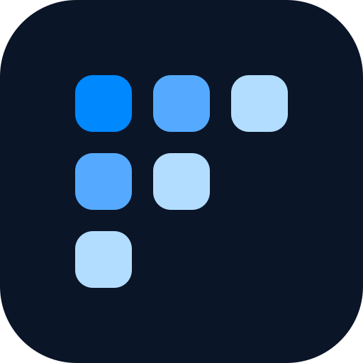

  

# Foglight Agent Builder

Turn a task into a skill pack for your coding agent.

**[Try it](https://try.foglight.co)**

Describe what you want to do. Foglight searches a catalog of open-source agent skills and returns a recommended pack, plus a copyable `npx skills add` install command.

The same catalog is an MCP server at [https://try.foglight.co/api/mcp](https://try.foglight.co/api/mcp). Any MCP client can search skills and pull an install command. The site is one such client: it runs those tools and turns your task into a pack.
